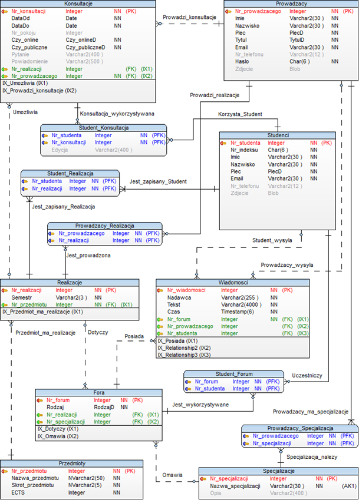
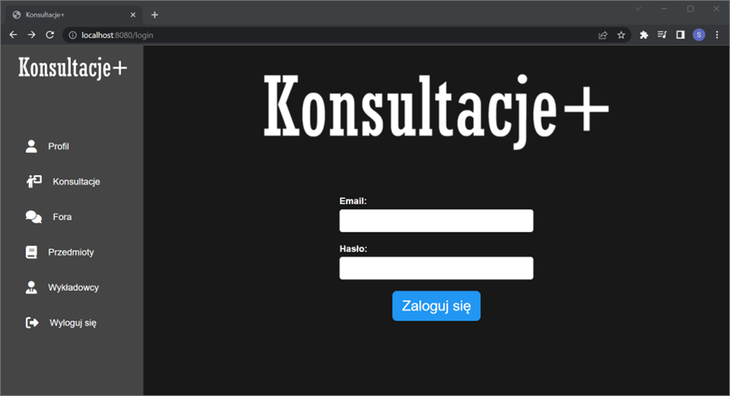

# Java-platform
A multimedia platform supporting the learning process. Mobile and web applications created with Java connected to database created with SQL.

### Database
 

### Web app interface
 

### Mobile app interface
 
